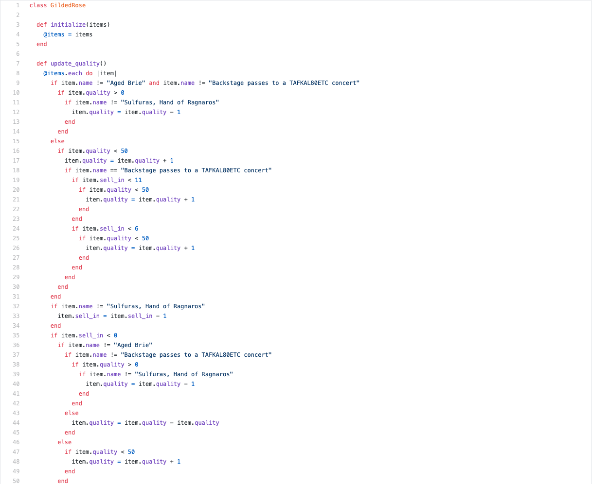

# Gilded Rose Refactoring Kata

This project is cloned from original [Gilded Rose Kata](https://github.com/emilybache/GildedRose-Refactoring-Kata)

The Gilded Rose is a refactoring Kata and the purpose of it is to enhance your refactoring skills.

The Kata comes in different languages and I implement it in Ruby

I've refactored this code & remove this nasty gigantic if condition using:
- Morgan's Laws
- Polymorphism
- Factory pattern
- Stateless objects
- Composition over inheritance
- More test cases
- Mutation testing to ease refactoring process
- Dependency injection

## Tested using:
----
- Minitest
- SimpleCov (coverage)
- mutant (mutation testing)
- Rubocop (linting)

### Run tests
----
```
$ ruby test/gilded_rose_test.rb
```

To run mutation tests:
```
$ bundle exec mutant run --require ./lib/quality.rb --require ./lib/inventory/backstage_pass.rb --require ./lib/inventory/aged_brie.rb --require ./lib/gilded_rose.rb --require ./lib/inventory/conjured.rb --require ./lib/inventory/generic.rb --require ./lib/good_factory.rb --require ./lib/item.rb  -I test --use minitest 'Quality' 'BackstagePass*' 'GildedRose' 'AgedBrie*' 'Conjured*' 'Generic*' 'GoodFactory' 'Item'
```

Mutations are covered 100%

## Legacy If condition
